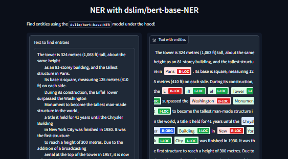
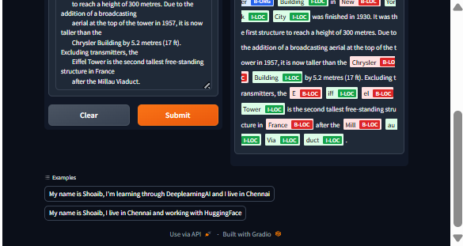

## Development of a Named Entity Recognition (NER) Prototype Using a Fine-Tuned BART Model and Gradio Framework

### AIM:
To design and develop a prototype application for Named Entity Recognition (NER) by leveraging a fine-tuned BART model and deploying the application using the Gradio framework for user interaction and evaluation.

### PROBLEM STATEMENT:
Developing a prototype application for Named Entity Recognition using a BART model and deploying it through Gradio framework.

### DESIGN STEPS:

#### STEP 1:
Load environment variables for HuggingFace endpoints and define a function get_completion() to interact with the inference API.

#### STEP 2:
Define ner() function to call the API and merge_tokens() to combine sub-word entities into readable, complete entities.
#### STEP 3:
Build and launch a user interface using Gradio, allowing text input and displaying highlighted NER output with sample examples.

### PROGRAM:
```
import os
import io
from IPython.display import Image, display, HTML
from PIL import Image
import base64 
from dotenv import load_dotenv, find_dotenv
_ = load_dotenv(find_dotenv()) # read local .env file
hf_api_key = os.environ['HF_API_KEY']

# Helper function
import gradio as gr
import requests, json

#Summarization endpoint
def get_completion(inputs, parameters=None,ENDPOINT_URL=os.environ['HF_API_SUMMARY_BASE']): 
    headers = {
      "Authorization": f"Bearer {hf_api_key}",
      "Content-Type": "application/json"
    }
    data = { "inputs": inputs }
    if parameters is not None:
        data.update({"parameters": parameters})
    response = requests.request("POST",
                                ENDPOINT_URL, headers=headers,
                                data=json.dumps(data)
                               )
    return json.loads(response.content.decode("utf-8"))

API_URL = os.environ['HF_API_NER_BASE'] 
text = ('''The tower is 324 metres (1,063 ft) tall, about the same height
        as an 81-storey building, and the tallest structure in Paris. 
        Its base is square, measuring 125 metres (410 ft) on each side. 
        During its construction, the Eiffel Tower surpassed the Washington 
        Monument to become the tallest man-made structure in the world,
        a title it held for 41 years until the Chrysler Building
        in New York City was finished in 1930. It was the first structure 
        to reach a height of 300 metres. Due to the addition of a broadcasting 
        aerial at the top of the tower in 1957, it is now taller than the 
        Chrysler Building by 5.2 metres (17 ft). Excluding transmitters, the 
        Eiffel Tower is the second tallest free-standing structure in France 
        after the Millau Viaduct.''')

get_completion(text, parameters=None, ENDPOINT_URL= API_URL)

def ner(input):
    output = get_completion(input, parameters=None, ENDPOINT_URL=API_URL)
    return {"text": input, "entities": output}

gr.close_all()
demo = gr.Interface(fn=ner,
                    inputs=[gr.Textbox(label="Text to find entities", lines=2)],
                    outputs=[gr.HighlightedText(label="Text with entities")],
                    title="NER with dslim/bert-base-NER",
                    description="Find entities using the `dslim/bert-base-NER` model under the hood!",
                    allow_flagging="never",
                    #Here we introduce a new tag, examples, easy to use examples for your application
                    examples=["My name is Shoaib and I live in Chennai", "My name is Shoaib and working with HuggingFace"])
demo.launch(share=True, server_port=int(os.environ['PORT3']))

def merge_tokens(tokens):
    merged_tokens = []
    for token in tokens:
        if merged_tokens and token['entity'].startswith('I-') and merged_tokens[-1]['entity'].endswith(token['entity'][2:]):
            # If current token continues the entity of the last one, merge them
            last_token = merged_tokens[-1]
            last_token['word'] += token['word'].replace('##', '')
            last_token['end'] = token['end']
            last_token['score'] = (last_token['score'] + token['score']) / 2
        else:
            # Otherwise, add the token to the list
            merged_tokens.append(token)

    return merged_tokens

def ner(input):
    output = get_completion(input, parameters=None, ENDPOINT_URL=API_URL)
    merged_tokens = merge_tokens(output)
    return {"text": input, "entities": merged_tokens}

gr.close_all()
demo = gr.Interface(fn=ner,
                    inputs=[gr.Textbox(label="Text to find entities", lines=2)],
                    outputs=[gr.HighlightedText(label="Text with entities")],
                    title="NER with dslim/bert-base-NER",
                    description="Find entities using the `dslim/bert-base-NER` model under the hood!",
                    allow_flagging="never",
                    examples=["My name is Shoaib, I'm learning through DeeplearningAI and I live in Chennai", "My name is Shoaib, I live in Chennai and working with HuggingFace"])

demo.launch(share=True, server_port=int(os.environ['PORT3']))

gr.close_all()
```

### OUTPUT:



### RESULT:
Thus, The prototype application for Named Entity Recognition (NER) by leveraging a fine-tuned BART model is executed successfully.
